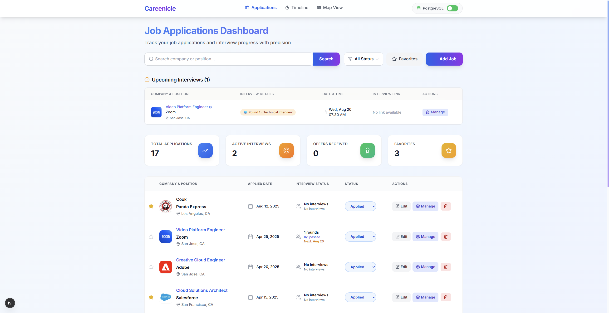
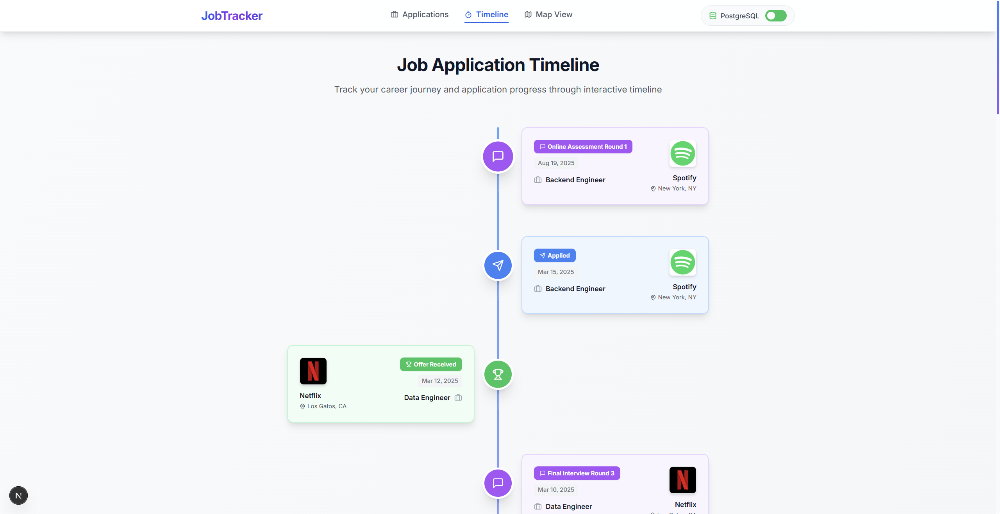
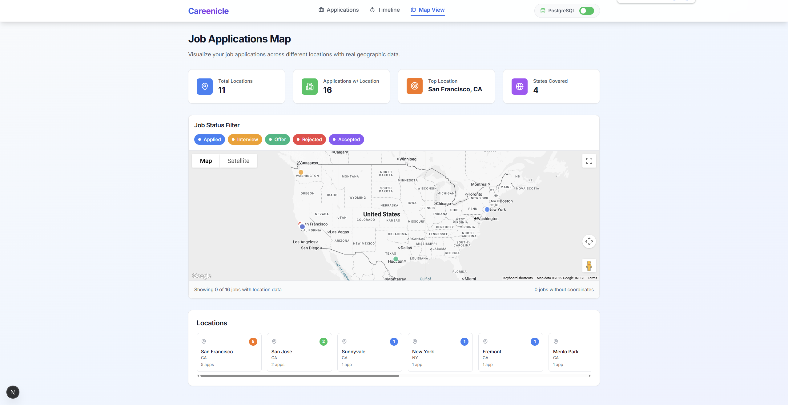

# Careenicle

A modern, intuitive job application tracking system built with Next.js 15, TypeScript, and PostgreSQL. Visualize your career journey, track job applications, schedule interviews, and explore opportunities on an interactive map interface.

## Features

- **Job Management**: Add, edit, and track job applications with smart location detection
- **Interactive Map View**: Visualize job locations on Google Maps with custom markers and info windows
- **Location Autocomplete**: Smart address completion powered by Google Places API
- **Timeline View**: Visual timeline of your application progress and milestones
- **Interview Scheduling**: Schedule and track different types of interviews (phone, video, onsite, technical, HR, final, online assessment, virtual onsite)
- **Event Tracking**: Comprehensive event system for all application stages
- **Geolocation Support**: Automatic coordinate detection for job locations
- **Responsive Design**: Works seamlessly on desktop and mobile devices

## Tech Stack

- **Frontend**: Next.js 15.2.4, React, TypeScript
- **Maps & Location**: Google Maps API
- **Styling**: Tailwind CSS, Radix UI components
- **Database**: PostgreSQL with PostGIS support
- **Package Manager**: pnpm

## Prerequisites

Before you begin, ensure you have the following installed:

- Node.js (version 18 or higher)
- pnpm package manager
- PostgreSQL database
- Google Maps API key (for map and autocomplete functionality)

## Installation and Setup

### 1. Install Dependencies

First, install the project dependencies using pnpm:

\`\`\`
pnpm install
\`\`\`

### 2. Database Setup

#### Create PostgreSQL Database

\`\`\`
CREATE DATABASE jobtracker;
\`\`\`

#### Initialize Database Schema

Run the database initialization script to create the required tables and schema:

\`\`\`
# Connect to your PostgreSQL database and run the schema script
psql -U your_username -d jobtracker -f scripts/init-scheme.sql
\`\`\`

#### Initialize Sample Data (Optional)

If you want to populate the database with sample data for testing:

\`\`\`
# Run the sample data script
psql -U your_username -d jobtracker -f scripts/init-sample-data.sql
\`\`\`

Alternatively, you can copy the contents of these scripts and run them in your preferred PostgreSQL client (pgAdmin, DBeaver, etc.).

### 3. Environment Configuration

#### Create Environment File

Copy the example environment file and create your local configuration:

\`\`\`
cp env.example .env.local
\`\`\`

#### Configure Environment Variables

Edit the `.env.local` file and configure the following variables:

\`\`\`
# Database Configuration
DB_USER=your_postgres_username
DB_HOST=localhost
DB_NAME=jobtracker
DB_PASSWORD=your_postgres_password
DB_PORT=5432

# Google Maps Configuration
NEXT_PUBLIC_GOOGLE_MAPS_API_KEY=your_google_maps_api_key
\`\`\`

**Important Configuration Notes:**

1. **Database Settings**: Replace with your actual PostgreSQL credentials
    - `your_postgres_username`: Your PostgreSQL username
    - `your_postgres_password`: Your PostgreSQL password
    - `localhost`: Your database host (change if using a remote database)
    - `5432`: Your PostgreSQL port (change if using a different port)

2. **Google Maps API Setup**:
    - Get a Google Cloud Platform account
    - Enable the following APIs in Google Cloud Console:
      - Maps JavaScript API
      - Places API (for location autocomplete)
    - Create an API key and replace `your_google_maps_api_key`
    - Configure API key restrictions for security

### 4. Start the Development Server

Run the development server:

\`\`\`
pnpm dev
\`\`\`

The application will be available at `http://localhost:3000`.

## Demo

## Key Features in Detail

### Interactive Map View
- **Visual Job Tracking**: See all your job applications plotted on an interactive Google Map
- **Status-Based Markers**: Different colored markers for each application status (Applied, Interview, Offer, Rejected, Accepted)
- **Rich Info Windows**: Hover over markers to see detailed job information including company logo, position, status, and notes
- **Status Filtering**: Filter map markers by application status
- **Location Statistics**: View metrics about jobs with and without location data

### Smart Location Input
- **Google Places Autocomplete**: Type-ahead location suggestions powered by Google Places API
- **Automatic Geocoding**: Addresses are automatically converted to coordinates for map display
- **Location Validation**: Ensures accurate positioning on the map

### Comprehensive Job Management
- **Application Tracking**: Monitor the complete lifecycle of each job application
- **Interview Scheduling**: Schedule and track various interview types
- **Event Timeline**: Chronological view of all application activities
- **Notes and Details**: Add detailed notes and track important information

## Project Structure

\`\`\`
careenicle/
├── app/                    # Next.js 15 App Router
│   ├── api/               # API routes
│   │   ├── jobs/          # Job management endpoints
│   │   └── job-events/    # Event management endpoints
│   ├── map/               # Interactive map page
│   ├── timeline/          # Timeline page
│   ├── globals.css        # Global styles
│   ├── layout.tsx         # Root layout
│   └── page.tsx           # Home page (job dashboard)
├── components/            # React components
│   ├── AddJobModal.tsx    # Job creation/editing modal
│   ├── EditJobModal.tsx   # Job editing interface
│   ├── GoogleJobMap.tsx   # Interactive Google Maps component
│   ├── InterviewModal.tsx # Interview scheduling modal
│   ├── JobTable.tsx       # Job listing table
│   ├── Timeline.tsx       # Timeline visualization
│   ├── Header.tsx         # Application header/navigation
│   └── ...               # Other UI components
├── lib/                   # Utility libraries
│   ├── database.ts        # Database connection
│   ├── dataService.ts     # Data access layer
│   ├── types.ts           # TypeScript type definitions
│   └── utils.ts           # Helper functions
├── scripts/               # Database scripts
│   ├── init-database.sql  # Database schema initialization
│   └── init-sample-data.sql # Sample data (optional)
└── public/               # Static assets
\`\`\`

## Database Schema

The application uses several main tables:

### Jobs Table
- Stores basic job application information
- Tracks application status and metadata
- **Location Support**: Includes `latitude`, `longitude` fields for map display
- **Location Data**: Stores formatted address strings for display

### Job Events Table
- Records all events related to job applications
- Supports various event types: applied, interview_scheduled, interview, rejected, offer_received, etc.
- Includes interview-specific fields for different interview types

### Location Features
- **Geocoding Support**: Automatic conversion of addresses to coordinates
- **Map Integration**: Seamless integration with Google Maps for visualization
- **Address Validation**: Ensures location data accuracy

## Interview Types Supported

- **phone**: Phone interviews
- **video**: Video interviews
- **onsite**: On-site interviews
- **technical**: Technical interviews
- **hr**: HR interviews
- **final**: Final round interviews
- **oa**: Online assessments
- **vo**: Virtual onsite interviews

## Available Scripts

- `pnpm dev`: Start development server
- `pnpm build`: Build for production
- `pnpm start`: Start production server
- `pnpm lint`: Run ESLint

## API Endpoints

### Jobs
- `GET /api/jobs`: Retrieve all jobs with location data
- `POST /api/jobs`: Create a new job (with geocoding support)
- `PUT /api/jobs/[id]`: Update a job (with location updates)
- `DELETE /api/jobs/[id]`: Delete a job
- `POST /api/jobs/[id]/favorite`: Toggle job favorite status

### Job Events
- `GET /api/job-events`: Retrieve all job events
- `POST /api/job-events`: Create a new job event
- `PUT /api/job-events/[id]`: Update a job event
- `DELETE /api/job-events/[id]`: Delete a job event

### Places API
- `GET /api/places/autocomplete?input={query}`: Get location suggestions for autocomplete
- `GET /api/places/geocode?placeId={placeId}`: Get coordinates from Google Place ID
- `GET /api/places/geocode?address={address}&company={company}`: Get coordinates from address string

## Google Maps Integration

### Setup Requirements
1. **Google Cloud Platform Account**: Required for API access
2. **Enable APIs**: Maps JavaScript API and Places API must be enabled
3. **API Key Configuration**: Set `NEXT_PUBLIC_GOOGLE_MAPS_API_KEY` in environment
4. **Usage Limits**: Monitor API usage to stay within quota limits

### Features
- **Interactive Maps**: Zoom, pan, and explore job locations
- **Custom Markers**: Status-based color coding for easy identification
- **Info Windows**: Rich popups with job details and company logos
- **Autocomplete**: Smart location suggestions during job entry
- **Responsive Design**: Works on all device sizes

## Contributing

1. Fork the repository
2. Create a feature branch
3. Make your changes
4. Run tests and linting
5. Submit a pull request

## Troubleshooting

### Database Connection Issues
- Verify PostgreSQL is running
- Check database credentials in `.env.local`
- Ensure the database `jobtracker` exists
- Verify network connectivity to database host
- Run initialization scripts in correct order (schema first, then sample data)

### Google Maps Issues
- Verify `NEXT_PUBLIC_GOOGLE_MAPS_API_KEY` is set in `.env.local`
- Check that Maps JavaScript API and Places API are enabled in Google Cloud Console
- Ensure API key has proper restrictions configured
- Monitor API quota usage in Google Cloud Console
- Check browser console for API-related errors

### Location/Geocoding Issues
- Verify Places API is enabled and working
- Check that location data is being saved to database correctly
- Ensure latitude/longitude fields are properly populated
- Test autocomplete functionality in job creation modal

### Build Issues
- Ensure all dependencies are installed: `pnpm install`
- Check Node.js version compatibility
- Clear next.js cache: `rm -rf .next`
- Verify all environment variables are properly set

### Environment Issues
- Ensure `.env.local` file exists and contains correct values
- Restart the development server after changing environment variables
- Check that API keys are valid and have necessary permissions

## License

This project is licensed under the MIT License.
