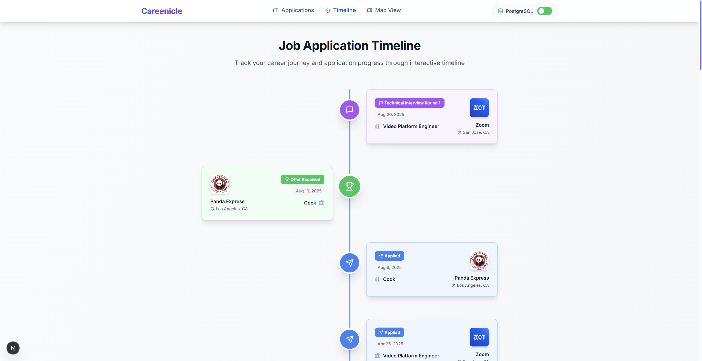

# Job Tracker

A modern job application tracking system built with Next.js 15, TypeScript, and PostgreSQL. Track your job applications, interview schedules, and progress through an intuitive timeline interface.

## Features

- **Job Management**: Add, edit, and track job applications
- **Timeline View**: Visual timeline of your application progress
- **Interview Scheduling**: Schedule and track different types of interviews (phone, video, onsite, technical, HR, final, online assessment, virtual onsite)
- **Event Tracking**: Comprehensive event system for all application stages
- **Responsive Design**: Works seamlessly on desktop and mobile devices

## Tech Stack

- **Frontend**: Next.js 15.2.4, React, TypeScript
- **Styling**: Tailwind CSS, Radix UI components
- **Database**: PostgreSQL
- **Package Manager**: pnpm

## Prerequisites

Before you begin, ensure you have the following installed:

- Node.js (version 18 or higher)
- pnpm package manager
- PostgreSQL database

## Installation and Setup

### 1. Install Dependencies

First, install the project dependencies using pnpm:

```bash
pnpm install
```

### 2. Database Setup

#### Create PostgreSQL Database

```sql
CREATE DATABASE jobtracker;
```

#### Initialize Database Schema and Sample Data

Run the database initialization script to create tables and populate with sample data:

Connect to your PostgreSQL instance and create the database:

```sql
CREATE DATABASE jobtracker;
```

#### Initialize Database Schema and Sample Data

Run the database initialization script to create tables and populate with sample data:

```bash
# Connect to your PostgreSQL database and run the script
psql -U your_username -d jobtracker -f scripts/init-database.sql
```

Alternatively, you can copy the contents of `scripts/init-database.sql` and run it in your preferred PostgreSQL client (pgAdmin, DBeaver, etc.).

### 3. Environment Configuration

#### Create Environment File

```bash
# Connect to your PostgreSQL database and run the script
psql -U your_username -d jobtracker -f scripts/init-database.sql
```

```bash
cp env.example .env.local
```

Alternatively, you can copy the contents of `scripts/init-database.sql` and run it in your preferred PostgreSQL client (pgAdmin, DBeaver, etc.).

### 3. Environment Configuration

#### Create Environment File

Copy the example environment file and rename it:

```bash
cp env.example .env.local
```

#### Configure Database Connection

```bash
# Database Configuration
DB_USER=your_postgres_username
DB_HOST=localhost
DB_NAME=jobtracker
DB_PASSWORD=your_postgres_password
DB_PORT=5432
```

Edit the `.env.local` file and replace the placeholder values with your actual database credentials:

```bash
# Database Configuration
DB_USER=your_postgres_username
DB_HOST=localhost
DB_NAME=jobtracker
DB_PASSWORD=your_postgres_password
DB_PORT=5432
```

Replace the following values:
- `your_postgres_username`: Your PostgreSQL username
- `your_postgres_password`: Your PostgreSQL password
- `localhost`: Your database host (change if using a remote database)
- `5432`: Your PostgreSQL port (change if using a different port)

### 4. Start the Development Server

Run the development server:

```bash
pnpm dev
```

The application will be available at `http://localhost:3000`.

## Demo



## Project Structure

```
job-tracker/
├── app/                    # Next.js 15 App Router
│   ├── api/               # API routes
│   │   ├── jobs/          # Job management endpoints
│   │   └── job-events/    # Event management endpoints
│   ├── timeline/          # Timeline page
│   ├── globals.css        # Global styles
│   ├── layout.tsx         # Root layout
│   └── page.tsx           # Home page
├── components/            # React components
│   ├── AddJobModal.tsx    # Job creation/editing modal
│   ├── InterviewModal.tsx # Interview scheduling modal
│   ├── JobTable.tsx       # Job listing table
│   ├── Timeline.tsx       # Timeline visualization
│   └── ...               # Other UI components
├── lib/                   # Utility libraries
│   ├── database.ts        # Database connection
│   ├── types.ts           # TypeScript type definitions
│   └── utils.ts           # Helper functions
├── scripts/               # Database scripts
│   └── init-database.sql  # Database initialization
└── public/               # Static assets
```

## Database Schema

The application uses two main tables:

### Jobs Table
- Stores basic job application information
- Tracks application status and metadata

### Job Events Table
- Records all events related to job applications
- Supports various event types: applied, interview_scheduled, interview, rejected, offer_received, etc.
- Includes interview-specific fields for different interview types

## Interview Types Supported

- **phone**: Phone interviews
- **video**: Video interviews
- **onsite**: On-site interviews
- **technical**: Technical interviews
- **hr**: HR interviews
- **final**: Final round interviews
- **oa**: Online assessments
- **vo**: Virtual onsite interviews

## Available Scripts

- `pnpm dev`: Start development server
- `pnpm build`: Build for production
- `pnpm start`: Start production server
- `pnpm lint`: Run ESLint

## API Endpoints

### Jobs
- `GET /api/jobs`: Retrieve all jobs
- `POST /api/jobs`: Create a new job
- `PUT /api/jobs/[id]`: Update a job
- `DELETE /api/jobs/[id]`: Delete a job

### Job Events
- `GET /api/job-events`: Retrieve all job events
- `POST /api/job-events`: Create a new job event
- `PUT /api/job-events/[id]`: Update a job event
- `DELETE /api/job-events/[id]`: Delete a job event

## Contributing

1. Fork the repository
2. Create a feature branch
3. Make your changes
4. Run tests and linting
5. Submit a pull request

## Troubleshooting

### Database Connection Issues
- Verify PostgreSQL is running
- Check database credentials in `.env.local`
- Ensure the database `jobtracker` exists
- Verify network connectivity to database host

### Build Issues
- Ensure all dependencies are installed: `pnpm install`
- Check Node.js version compatibility
- Clear next.js cache: `rm -rf .next`

### Environment Issues
- Ensure `.env.local` file exists and contains correct values
- Restart the development server after changing environment variables

## License

This project is licensed under the MIT License.
